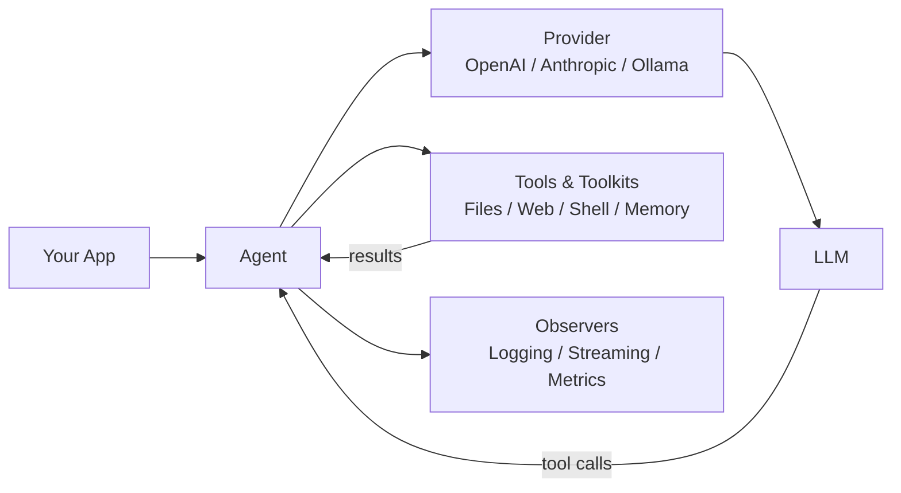

# php-agents

PHP 8.4+ framework for building AI agents with tool-use loops, provider abstraction, and composable toolkits.

Build agents that can read files, browse the web, execute code, and use custom tools — powered by any OpenAI-compatible API, Anthropic, or local models via Ollama.



## Features

- **Agentic tool-use loop** — automatic iteration: the LLM calls tools, processes results, and decides when it's done
- **Multi-provider** — Ollama (local), OpenAI, Anthropic, OpenRouter, or any OpenAI-compatible endpoint
- **Streaming + tool calls** — both OpenAI and Anthropic providers support streaming with assembled tool call deltas
- **Structured output** — extract typed data from LLMs via JSON mode (OpenAI) or tool-use trick (Anthropic)
- **Image input** — send base64 images to vision models (auto-converts between OpenAI and Anthropic formats)
- **Bundled agents** — `FileAgent`, `WebAgent`, `CodeAgent` ready to use out of the box
- **Composable toolkits** — filesystem, web, shell, and memory toolkits that snap onto any agent
- **Context window management** — automatic conversation pruning when approaching token limits
- **Observer pattern** — attach `SplObserver` to watch agent lifecycle events in real time
- **Security by default** — path traversal protection, SSRF blocking, shell injection detection
- **OpenClaw config** — centralized model routing with aliases, fallbacks, and per-provider settings
- **Zero framework coupling** — depends only on `symfony/http-client` and `psr/log`

## Provider Feature Matrix

| Feature                | OpenAI Compatible | Ollama | Anthropic |
| ---------------------- | :---------------: | :----: | :-------: |
| `chat()`               |         ✅         |   ✅    |     ✅     |
| `stream()`             |         ✅         |   ✅    |     ✅     |
| `structured()`         |         ✅         |   ✅    |     ✅     |
| Tool calling           |         ✅         |   ✅    |     ✅     |
| Streaming + tool calls |         ✅         |   ✅    |     ✅     |
| Image input (base64)   |         ✅         |   ✅    |     ✅     |
| `models()` list        |         ✅         |   ✅    |     ✅     |
| `isAvailable()`        |         ✅         |   ✅    |     ✅     |

## Requirements

- PHP 8.4 or later
- Extensions: `curl`, `json`, `mbstring`
- Composer 2.x
- [Ollama](https://ollama.ai) (recommended for local inference)

## Installation

```bash
composer require carmelosantana/php-agents
```

## Quick Start

Create an agent that can read files and answer questions about them:

```php
<?php

declare(strict_types=1);

require 'vendor/autoload.php';

use CarmeloSantana\PHPAgents\Agent\FileAgent;
use CarmeloSantana\PHPAgents\Provider\OllamaProvider;
use CarmeloSantana\PHPAgents\Message\UserMessage;

$provider = new OllamaProvider(model: 'llama3.2');

$agent = new FileAgent(
    provider: $provider,
    rootPath: getcwd(),
    readOnly: true,
);

$output = $agent->run(new UserMessage('Summarize the README.md file.'));

echo $output->content . "\n";
```

> Make sure Ollama is running: `ollama serve` and a model is pulled: `ollama pull llama3.2`

## Bundled Agents

| Agent       | Description                                                        | Toolkits                             |
| ----------- | ------------------------------------------------------------------ | ------------------------------------ |
| `FileAgent` | Read, write, search, and manage files within a sandboxed root path | `FilesystemToolkit`                  |
| `WebAgent`  | Make HTTP requests and optionally search the web                   | `WebToolkit`                         |
| `CodeAgent` | Filesystem access + shell command execution with an allowlist      | `FilesystemToolkit` + `ShellToolkit` |

## Providers

```php
use CarmeloSantana\PHPAgents\Provider\OllamaProvider;
use CarmeloSantana\PHPAgents\Provider\OpenAICompatibleProvider;
use CarmeloSantana\PHPAgents\Provider\AnthropicProvider;

// Ollama (local — no API key needed)
$provider = new OllamaProvider(model: 'llama3.2');

// OpenAI
$provider = new OpenAICompatibleProvider(
    model: 'gpt-4o',
    apiKey: getenv('OPENAI_API_KEY'),
);

// Anthropic
$provider = new AnthropicProvider(
    model: 'claude-sonnet-4-20250514',
    apiKey: getenv('ANTHROPIC_API_KEY'),
);

// Any OpenAI-compatible endpoint (OpenRouter, Together, Groq, vLLM, etc.)
$provider = new OpenAICompatibleProvider(
    model: 'meta-llama/llama-3.1-70b-instruct',
    apiKey: getenv('OPENROUTER_API_KEY'),
    baseUrl: 'https://openrouter.ai/api/v1',
);
```

## Creating Custom Agents

Extend `AbstractAgent` and implement `instructions()`:

```php
<?php

declare(strict_types=1);

namespace MyPackage;

use CarmeloSantana\PHPAgents\Agent\AbstractAgent;
use CarmeloSantana\PHPAgents\Contract\ProviderInterface;

final class DatabaseAgent extends AbstractAgent
{
    public function __construct(ProviderInterface $provider)
    {
        parent::__construct($provider, maxIterations: 10);
    }

    public function instructions(): string
    {
        return 'You are a database agent. Query databases and return results.';
    }

    public function name(): string
    {
        return 'DatabaseAgent';
    }
}
```

Register toolkits in the constructor with `$this->addToolkit()` to give your agent capabilities.

## Creating Custom Tools

Define tools with typed parameters and a callback:

```php
use CarmeloSantana\PHPAgents\Tool\Tool;
use CarmeloSantana\PHPAgents\Tool\ToolResult;
use CarmeloSantana\PHPAgents\Tool\Parameter\StringParameter;

$tool = new Tool(
    name: 'word_count',
    description: 'Count words in the given text',
    parameters: [
        new StringParameter('text', 'The text to count words in', required: true),
    ],
    callback: fn(array $args): ToolResult => ToolResult::success(
        'Word count: ' . str_word_count($args['text']),
    ),
);
```

Group related tools into a toolkit by implementing `ToolkitInterface`:

```php
use CarmeloSantana\PHPAgents\Contract\ToolkitInterface;

final class MyToolkit implements ToolkitInterface
{
    public function tools(): array
    {
        return [$this->buildWordCountTool(), /* ... */];
    }

    public function guidelines(): string
    {
        return 'Use these tools to analyze text.';
    }
}
```

### Toolkit Auto-Discovery

Publish your toolkit as a Composer package with auto-discovery:

```json
{
    "extra": {
        "php-agents": {
            "toolkits": ["Acme\\MyToolkit\\MyToolkit"],
            "credentials": {
                "MY_API_KEY": "API key for MyService — get one at https://myservice.com/keys"
            }
        }
    }
}
```

## Documentation

| Guide                                          | Description                                              |
| ---------------------------------------------- | -------------------------------------------------------- |
| [Architecture](docs/architecture.md)           | System design, Mermaid diagrams, extension points        |
| [Getting Started](docs/getting-started.md)     | Installation, provider setup, first agent                |
| [Providers](docs/providers.md)                 | Feature matrix, streaming, structured output, images     |
| [Tools & Toolkits](docs/tools-and-toolkits.md) | Parameter types, execution policies, publishing packages |
| [Agents](docs/agents.md)                       | Agent loop, observers, cancellation, context window      |
| [Memory](docs/memory.md)                       | Persistent storage, vector search, embeddings            |

## Examples

Working examples live in the [`examples/`](examples/) directory:

| Example                                       | Description                                               | Run                                                 |
| --------------------------------------------- | --------------------------------------------------------- | --------------------------------------------------- |
| [CLI Chat](examples/cli-chat.php)             | Interactive terminal conversation with an LLM             | `php examples/cli-chat.php`                         |
| [README Summarizer](examples/web-summarizer/) | Web UI that auto-summarizes this README using a FileAgent | `php -S localhost:8080 -t examples/web-summarizer/` |

## `php-agents` In The Wild

[Coqui](https://github.com/AgentCoqui/coqui) is a full AI assistant product built on php-agents. It demonstrates the framework's extensibility:

- **php-agents** is the **library** — agent loop, providers, tools, messages, memory
- **Coqui** is the **product** — REPL, API server, session persistence, multi-agent orchestration, credential management, security policies, toolkit discovery

Coqui adds product logic on top of `php-agents` framework code, with zero code duplication. Each Coqui agent (`OrchestratorAgent`, `ChildAgent`) extends `AbstractAgent` — they are purely configuration layers.

## License

MIT
