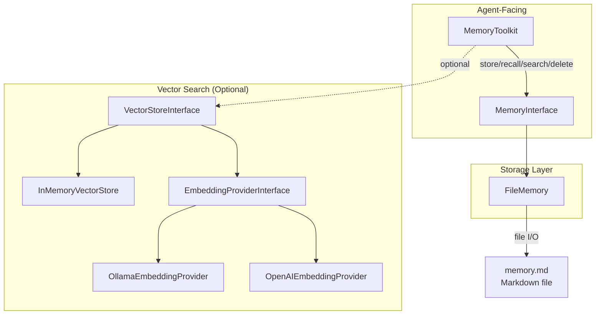
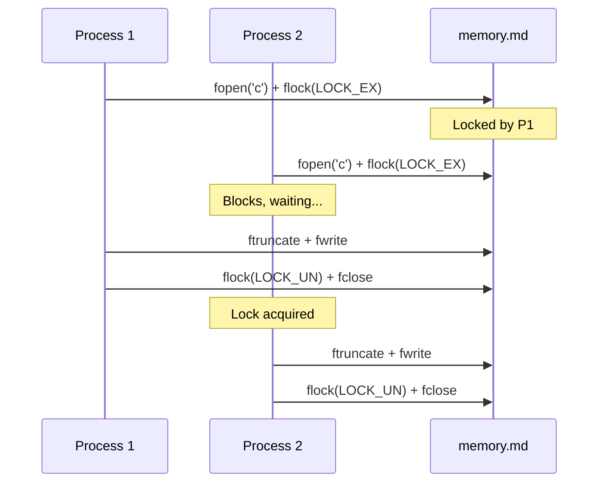

# Memory

php-agents provides a layered memory system: simple key-value storage, persistent file-backed memory, and vector similarity search for semantic retrieval.

## Architecture



## MemoryInterface

The base contract for all memory implementations:

```php
interface MemoryInterface
{
    /** Store a value with a key and optional metadata. */
    public function store(string $key, string $value, array $metadata = []): void;

    /** Retrieve a value by key. Returns null if not found. */
    public function recall(string $key): ?string;

    /** Search memories matching a query string. */
    public function search(string $query, int $limit = 5): array;

    /** Delete a memory entry by key. */
    public function delete(string $key): bool;

    /** Get all stored memories. */
    public function all(): array;
}
```

## FileMemory

Persists memories to a Markdown file. Each entry is a third-level heading with the key as the title and the value as the body:

```php
use CarmeloSantana\PHPAgents\Memory\FileMemory;

$memory = new FileMemory('/path/to/memory.md');

$memory->store('project-goal', 'Build an AI-powered code reviewer');
$memory->store('tech-stack', 'PHP 8.4, SQLite, ReactPHP');

echo $memory->recall('project-goal');
// "Build an AI-powered code reviewer"
```

### File Format

The Markdown file looks like this:

```markdown
# Agent Memory

### [project-goal]

Build an AI-powered code reviewer

### [tech-stack]

PHP 8.4, SQLite, ReactPHP
```

### Concurrency Safety

`FileMemory::persist()` uses exclusive file locking (`flock(LOCK_EX)`) to prevent data corruption when multiple processes write simultaneously:



### Search Behavior

`FileMemory::search()` performs simple substring matching on keys and values. For semantic search, use a vector store.

## MemoryToolkit

Exposes memory operations as tools the agent can use:

```php
use CarmeloSantana\PHPAgents\Toolkit\MemoryToolkit;
use CarmeloSantana\PHPAgents\Memory\FileMemory;

$toolkit = new MemoryToolkit(
    memory: new FileMemory('/path/to/memory.md'),
);

$agent->addToolkit($toolkit);
```

### Tools Provided

| Tool | Parameters | Description |
|------|-----------|-------------|
| `memory_store` | `key` (string), `value` (string) | Store a key-value pair |
| `memory_recall` | `key` (string) | Retrieve a value by key |
| `memory_search` | `query` (string), `limit` (number, optional) | Search memories |
| `memory_delete` | `key` (string) | Delete a memory entry |

### Guidelines

The toolkit injects guidelines instructing the LLM when to use memory:

> Use memory tools to persist important information across conversations. Store key decisions, user preferences, project context, and any information that should be remembered. Always check memory before asking the user for information they may have already provided.

## Vector Stores

For semantic similarity search (finding memories by meaning rather than exact text), use a vector store with an embedding provider.

### InMemoryVectorStore

A simple in-memory vector store for development and small datasets:

```php
use CarmeloSantana\PHPAgents\Memory\InMemoryVectorStore;
use CarmeloSantana\PHPAgents\Embedding\OllamaEmbeddingProvider;

$embedder = new OllamaEmbeddingProvider(model: 'nomic-embed-text');
$vectorStore = new InMemoryVectorStore();

// Store with embeddings
$embedding = $embedder->embed('PHP is a server-side scripting language');
$vectorStore->upsert('php-desc', $embedding, ['text' => 'PHP is a server-side scripting language']);

// Search by similarity
$queryEmbedding = $embedder->embed('What programming language runs on servers?');
$results = $vectorStore->search($queryEmbedding, limit: 3);
// Returns nearest neighbors by cosine similarity
```

### VectorStoreInterface

```php
interface VectorStoreInterface
{
    /** Insert or update a vector with metadata. */
    public function upsert(string $id, array $embedding, array $metadata = []): void;

    /** Search for nearest neighbors. */
    public function search(array $embedding, int $limit = 5): array;

    /** Delete a vector by ID. */
    public function delete(string $id): bool;
}
```

## Embedding Providers

### OllamaEmbeddingProvider

Uses Ollama's local embedding models:

```php
use CarmeloSantana\PHPAgents\Embedding\OllamaEmbeddingProvider;

$embedder = new OllamaEmbeddingProvider(
    model: 'nomic-embed-text',
    baseUrl: 'http://localhost:11434',
);

$vector = $embedder->embed('Hello, world!');
// float[] — the embedding vector
```

### OpenAIEmbeddingProvider

Uses OpenAI's embedding API:

```php
use CarmeloSantana\PHPAgents\Embedding\OpenAIEmbeddingProvider;

$embedder = new OpenAIEmbeddingProvider(
    model: 'text-embedding-3-small',
    apiKey: getenv('OPENAI_API_KEY'),
);

$vector = $embedder->embed('Hello, world!');
```

### EmbeddingProviderInterface

```php
interface EmbeddingProviderInterface
{
    /** Convert text to an embedding vector. */
    public function embed(string $text): array;
}
```

## Combining Memory Layers

For production use, combine FileMemory for simple key-value storage with a vector store for semantic search:

```php
use CarmeloSantana\PHPAgents\Memory\FileMemory;
use CarmeloSantana\PHPAgents\Memory\InMemoryVectorStore;
use CarmeloSantana\PHPAgents\Embedding\OllamaEmbeddingProvider;
use CarmeloSantana\PHPAgents\Toolkit\MemoryToolkit;

// Simple persistent storage
$memory = new FileMemory('/data/agent-memory.md');

// Semantic search layer
$embedder = new OllamaEmbeddingProvider(model: 'nomic-embed-text');
$vectorStore = new InMemoryVectorStore();

// The toolkit uses FileMemory for CRUD
$toolkit = new MemoryToolkit(memory: $memory);
$agent->addToolkit($toolkit);

// You can build a custom tool that combines both:
// 1. Store in FileMemory for persistence
// 2. Store embedding in vector store for semantic search
// 3. On search, query vector store first, fall back to FileMemory
```

For persistent vector storage at scale, consider the suggested `hkulekci/qdrant` package which provides a Qdrant vector database client.
