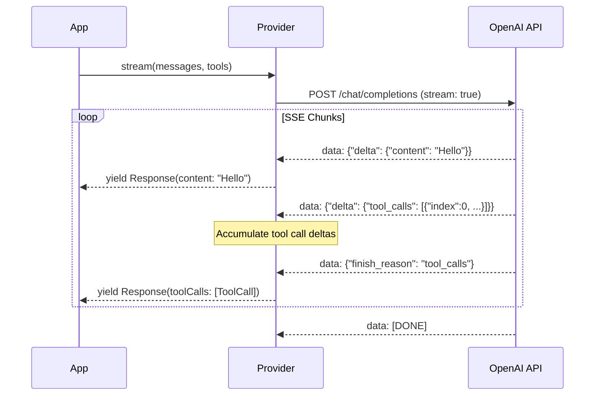
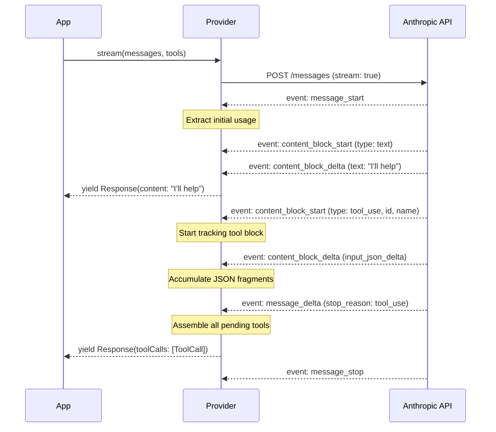

# Providers

Providers abstract the differences between LLM APIs. php-agents ships with three providers covering the major ecosystems.

## Provider Feature Matrix

| Feature | OpenAI Compatible | Ollama | Anthropic |
|---------|:-:|:-:|:-:|
| `chat()` | ✅ | ✅ | ✅ |
| `stream()` | ✅ | ✅ | ✅ |
| `structured()` | ✅ | ✅ | ✅ |
| Tool calling | ✅ | ✅ | ✅ |
| Streaming + tool calls | ✅ | ✅ | ✅ |
| Image input (base64) | ✅ | ✅ | ✅ |
| Image input (URL) | ✅ | ✅ | ❌ |
| `models()` list | ✅ | ✅ | ✅ |
| `isAvailable()` health check | ✅ | ✅ | ✅ |
| `withModel()` immutable swap | ✅ | ✅ | ✅ |

## OpenAICompatibleProvider

The base provider for any API that follows the OpenAI chat completions format. Works with OpenAI, OpenRouter, Together, Groq, vLLM, LM Studio, and many others.

```php
use CarmeloSantana\PHPAgents\Provider\OpenAICompatibleProvider;

$provider = new OpenAICompatibleProvider(
    model: 'gpt-4o',
    apiKey: getenv('OPENAI_API_KEY'),
    baseUrl: 'https://api.openai.com/v1',  // default
);
```

### Configuration

| Parameter | Type | Default | Description |
|-----------|------|---------|-------------|
| `model` | `string` | — | Model identifier (required) |
| `apiKey` | `string` | `''` | API key for authentication |
| `baseUrl` | `string` | `'https://api.openai.com/v1'` | API base URL |
| `httpClient` | `?HttpClientInterface` | `null` | Custom Symfony HTTP client |

### Environment Variables

The provider reads these if not passed directly:

| Variable | Used By |
|----------|---------|
| `OPENAI_API_KEY` | `OpenAICompatibleProvider` |

### Streaming with Tool Calls

The `stream()` method yields `Response` objects as SSE chunks arrive. Tool call deltas are accumulated across chunks and yielded as complete `ToolCall` objects when the model signals `finish_reason: tool_calls`:

```php
foreach ($provider->stream($messages, $tools) as $response) {
    // Text content arrives incrementally
    if ($response->content !== '') {
        echo $response->content;
    }

    // Tool calls arrive fully assembled when the model is done calling
    foreach ($response->toolCalls as $toolCall) {
        $result = $tool->execute($toolCall->arguments);
    }
}
```



### Structured Output

Uses OpenAI's JSON mode with response format:

```php
$result = $provider->structured(
    messages: [new UserMessage('Extract the name and age from: "John is 30 years old"')],
    schema: [
        'type' => 'object',
        'properties' => [
            'name' => ['type' => 'string'],
            'age' => ['type' => 'integer'],
        ],
        'required' => ['name', 'age'],
    ],
);
// ['name' => 'John', 'age' => 30]
```

### Using with Other Services

```php
// OpenRouter
$provider = new OpenAICompatibleProvider(
    model: 'anthropic/claude-sonnet-4-20250514',
    apiKey: getenv('OPENROUTER_API_KEY'),
    baseUrl: 'https://openrouter.ai/api/v1',
);

// Together AI
$provider = new OpenAICompatibleProvider(
    model: 'meta-llama/Llama-3.1-70B-Instruct-Turbo',
    apiKey: getenv('TOGETHER_API_KEY'),
    baseUrl: 'https://api.together.xyz/v1',
);

// Local vLLM / LM Studio
$provider = new OpenAICompatibleProvider(
    model: 'my-model',
    baseUrl: 'http://localhost:8000/v1',
);
```

## OllamaProvider

Extends `OpenAICompatibleProvider` with Ollama-specific model listing and health checks.

```php
use CarmeloSantana\PHPAgents\Provider\OllamaProvider;

$provider = new OllamaProvider(
    model: 'llama3.2',
    baseUrl: 'http://localhost:11434',  // default
);
```

### Configuration

| Parameter | Type | Default | Description |
|-----------|------|---------|-------------|
| `model` | `string` | — | Model name (as pulled with `ollama pull`) |
| `baseUrl` | `string` | `'http://localhost:11434'` | Ollama server URL |
| `httpClient` | `?HttpClientInterface` | `null` | Custom HTTP client |

### Model Discovery

```php
$models = $provider->models();
// Returns ModelDefinition[] with name, contextWindow, maxTokens
// Reads from Ollama's /api/tags endpoint
```

### Health Check

```php
if ($provider->isAvailable()) {
    // Ollama is running and responding
}
// Hits GET /api/tags — returns true if 2xx
```

### Environment Variables

| Variable | Used By |
|----------|---------|
| `OLLAMA_HOST` | `OllamaProvider` (falls back to `http://localhost:11434`) |

## AnthropicProvider

Purpose-built provider for Claude models. Handles Anthropic's unique message format (system as top-level parameter, not a message), content block types, and tool use protocol.

```php
use CarmeloSantana\PHPAgents\Provider\AnthropicProvider;

$provider = new AnthropicProvider(
    model: 'claude-sonnet-4-20250514',
    apiKey: getenv('ANTHROPIC_API_KEY'),
);
```

### Configuration

| Parameter | Type | Default | Description |
|-----------|------|---------|-------------|
| `model` | `string` | — | Model identifier (required) |
| `apiKey` | `string` | `''` | Anthropic API key |
| `baseUrl` | `string` | `'https://api.anthropic.com/v1'` | API base URL |
| `httpClient` | `?HttpClientInterface` | `null` | Custom HTTP client |

### Image Support

Anthropic uses a different image format than OpenAI. php-agents automatically converts between formats:

```php
// This works with both OpenAI and Anthropic providers:
$message = new UserMessage([
    ['type' => 'text', 'text' => 'What is in this image?'],
    [
        'type' => 'image_url',
        'image_url' => [
            'url' => 'data:image/png;base64,' . base64_encode(file_get_contents('photo.png')),
        ],
    ],
]);

// OpenAI sends it as-is
// Anthropic converts to: {type: "image", source: {type: "base64", media_type: "image/png", data: "..."}}
```

**Note:** Anthropic does not support URL-based images. Only base64-encoded data URIs work.

### Streaming with Tool Calls

Anthropic uses a different streaming protocol (content blocks + deltas) than OpenAI (token-level deltas). php-agents normalizes both to the same `Response` yield pattern:



### Structured Output

Uses Anthropic's tool-use trick: defines the schema as a tool, forces the model to use it, and extracts the structured result:

```php
$result = $provider->structured(
    messages: [new UserMessage('Extract: "Jane, age 25, from NYC"')],
    schema: [
        'type' => 'object',
        'properties' => [
            'name' => ['type' => 'string'],
            'age' => ['type' => 'integer'],
            'city' => ['type' => 'string'],
        ],
        'required' => ['name', 'age', 'city'],
    ],
);
// ['name' => 'Jane', 'age' => 25, 'city' => 'NYC']
```

### Model List

The provider tries Anthropic's models API first, then falls back to a static list:

```php
$models = $provider->models();
// ModelDefinition[] — includes context windows and max output tokens
```

Static fallback models:

| Model | Context Window | Max Output |
|-------|:-:|:-:|
| `claude-sonnet-4-20250514` | 200K | 8,192 |
| `claude-opus-4-20250514` | 200K | 32,000 |
| `claude-3-5-haiku-20241022` | 200K | 8,192 |
| `claude-3-5-sonnet-20241022` | 200K | 8,192 |
| `claude-3-opus-20240229` | 200K | 4,096 |
| `claude-3-haiku-20240307` | 200K | 4,096 |

### Health Check

```php
if ($provider->isAvailable()) {
    // API key is valid and Anthropic API is responding
}
// Makes actual HTTP request to /models endpoint
```

### Environment Variables

| Variable | Used By |
|----------|---------|
| `ANTHROPIC_API_KEY` | `AnthropicProvider` |

## Creating a Custom Provider

Implement `ProviderInterface` or extend `AbstractProvider`:

```php
<?php

declare(strict_types=1);

namespace Acme\MyProvider;

use CarmeloSantana\PHPAgents\Contract\ProviderInterface;
use CarmeloSantana\PHPAgents\Message\Response;
use CarmeloSantana\PHPAgents\Provider\ModelDefinition;
use CarmeloSantana\PHPAgents\Tool\ToolCall;
use CarmeloSantana\PHPAgents\Tool\Usage;

final class MyProvider implements ProviderInterface
{
    public function chat(array $messages, array $tools = [], array $options = []): Response
    {
        // Send messages to your LLM, return a Response
        return new Response(
            content: 'Hello from my provider',
            toolCalls: [],
            usage: new Usage(inputTokens: 10, outputTokens: 5),
        );
    }

    public function stream(array $messages, array $tools = [], array $options = []): iterable
    {
        // Yield Response objects as they arrive
        yield new Response(content: 'Hello');
        yield new Response(content: ' world');
    }

    public function structured(array $messages, array $schema, array $options = []): mixed
    {
        // Return structured data matching the schema
        return ['result' => 'value'];
    }

    public function models(): array
    {
        return [
            new ModelDefinition(
                id: 'my-model',
                contextWindow: 128_000,
                maxTokens: 4096,
            ),
        ];
    }

    public function isAvailable(): bool
    {
        // Check if the provider is reachable
        return true;
    }

    public function getModel(): string
    {
        return 'my-model';
    }

    public function withModel(string $model): static
    {
        $clone = clone $this;
        // set model on clone
        return $clone;
    }
}
```
